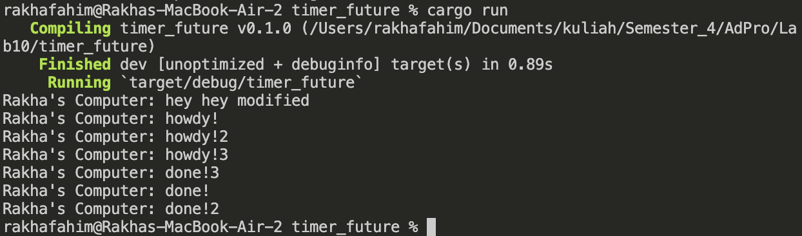
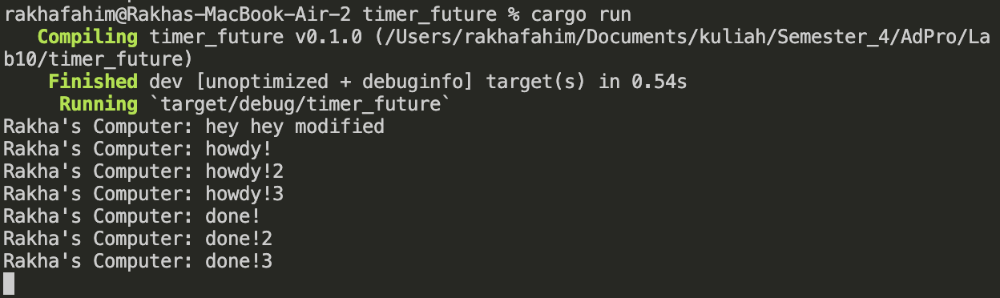

# Reflection

## Experiment 1.2: Understanding how it works.

"hey hey modified" came first because the we put it outside the asynchronous task.

## Experiment 1.3: Multiple Spawn and removing drop
### drop

### drop removed

if drop spawn is removed the task will never stop on going it will keep going until there's a drop.